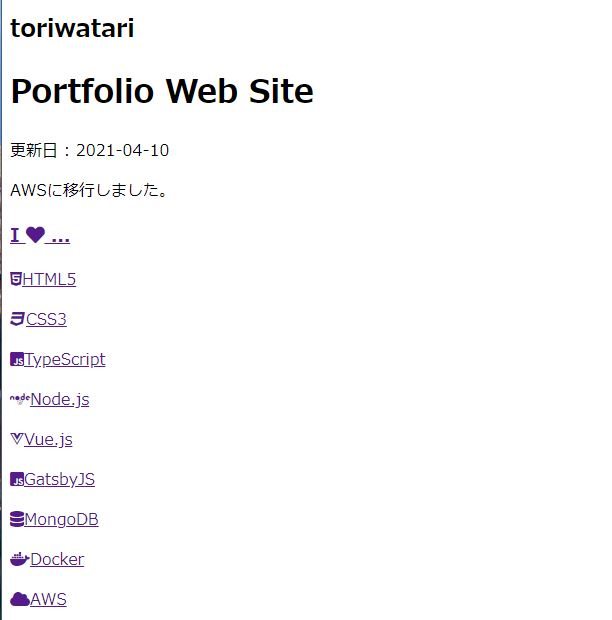
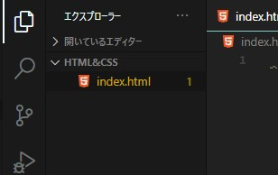
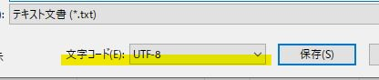
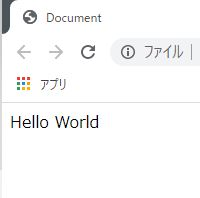
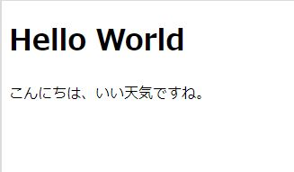
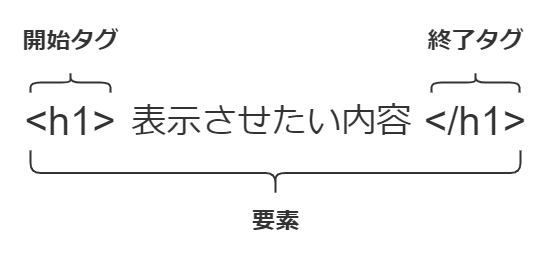
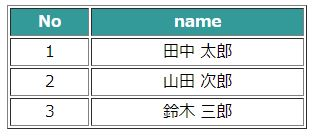
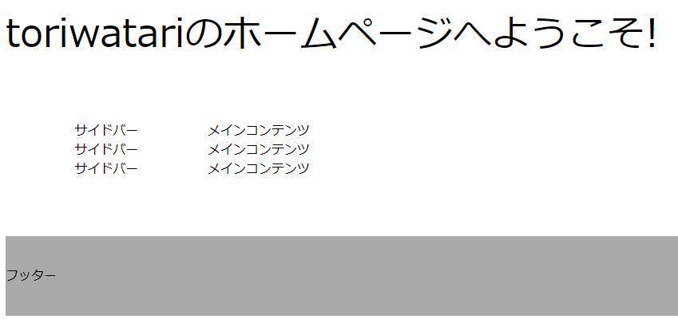

# 最初の一歩

このページでは

- HTMLの解説
- HTMLファイルを作成する
- 文章をページに表示させる

上記3つを行います。

当ブログのモットーは**最小構成 & スモールステップ**です。やることは**シンプル**に、そして**目標は小さく設定**し、一つずつクリアしていけばHTMLとCSSの学習は難しくありません。

## HTMLとCSS

こんな辺境のブログにまで来ている人なら、せめてHTMLとCSSという単語くらいは聞いたことがあると思います。「ホームページを作るプログラミング言語」みたいな認識はあると思います。

ではHTMLとCSSとはいったい何を行うものなのでしょうか。2つセットで語られることが多いような気がしますが、いったいどんな意味を持つのでしょうか。

HTMLは**HyperText Markup Language**のことで、Webサイトの**文書構造**を表すための言語です。「文書構造」という言葉が分かりにくいかもしれませんが、「どのような文章が書かれているか、どのような画像が使われているか」をHTMLで記述し、Webブラウザに読み込ませて表示させるものです。

CSSは**Cascading Style Sheets**のことで、Webサイトの**デザイン**を装飾するための言語です。文字の大きさや画面の背景色をカスタマイズするのはCSSの仕事です。

私のポートフォリオサイトを例に、HTMLとCSSの違いを説明します。以下は私のポートフォリオサイトのキャプチャです。


このWebサイトはhtmlファイルとcssファイルを組み合わせて作成しています。

cssファイルを削除し、htmlファイルだけの状態にすると以下のように変化します。



緑色の背景や文字の配置位置などがなくなり、不愛想なただの文字の羅列になりました。

前述したようにHTMLは**文書構造**を表すための言語です。ポートフォリオサイトの例で言うと、「**ページのタイトルは**toriwatari Portfolio Web Siteです。」「ページの**更新日付は**2021年4月10日です。」といった内容を読者やWebブラウザに伝えます。

そしてそのHTMLをデザインするのがCSSの仕事です。

HTMLはWebページの土台であり骨組みです。HTMLなくしてCSSはありません。

このようにHTMLとCSSは明確に役割が分かれています。「HTMLは文書構造、CSSは文書構造をデザイン」と憶えておきましょう。

## htmlファイルを作成する

まずはhtmlファイルを作って好きな文字を表示させてみましょう。

まずは作業フォルダを作成します。任意の場所に「workspace」という名前のフォルダを作成、その中に「HTML&CSS」フォルダを作成します。このフォルダの中に今回の学習の成果物を置いていくことにしましょう。

HTML&CSSフォルダの中に`index.html`ファイルを作成します。ファイル名の`index`は変更可能ですが、慣習的に`index`が用いられていますので、そう命名することをお勧めします。拡張子である`html`は変更不可です。

---

VSCodeをお使いの方に向けて、VSCodeでの上記の手順を記述しておきます。

VSCodeを立ち上げ、`ファイル(F)`を開き、`フォルダーを開く`を選択します。


そして先ほど作成した`HTML&CSS`フォルダを選択し、`フォルダーの選択`をクリックします。


これでVSCodeでフォルダを開くことができました。


さらに、`HTML&CSS`フォルダの少し下で右クリックし、`新しいファイル`をクリックします。


続けて`index.html`と打ち込めばhtmlファイルの出来上がりです。



## htmlファイルに内容を書きこむ

では、htmlファイルの内容を編集していきます。VSCodeをお使いの方は、1行目に半角の`!`を入力してください。すると以下のようなポップアップが表示されると思います。


続けてTabキーを押下すると、HTMLファイルのひな型が自動的に作成されます。便利です。


上手く動かない、VSCodeを使用していないという方は、以下のコードをコピーして張り付けてください。

```html
<!DOCTYPE html>
<html lang="ja">
<head>
  <meta charset="UTF-8">
  <meta name="viewport" content="width=device-width, initial-scale=1.0">
  <title>Document</title>
</head>
<body>
  
</body>
</html>
```

続けて、9行目、`<body>`と`</body>`の間の行にページに表示させたい任意の文字列を入力します。こういう時は「Hello World」と入力すると相場は決まっていますのでそうしてみましょう。

```html{9}:title=index.html
<!DOCTYPE html>
<html lang="ja">
<head>
  <meta charset="UTF-8">
  <meta name="viewport" content="width=device-width, initial-scale=1.0">
  <title>Document</title>
</head>
<body>
  Hello World  
</body>
</html>
```

入力が完了したらファイルを保存します。

ファイルを保存する際の**文字コード**に注意してください。htmlファイルを作成する時の文字コードは**UTF-8**を選択するのが通例です。最近のWindowsは自動的にUTF-8が選択されますが、古めのWindowsを使用している方はUTF-8になっているかどうかを確認してください。

メモ帳であれば「ファイル」→「名前を付けて保存」で文字コードを選択できます。



これでHTMLファイルが完成です。完成したHTMLファイルをダブルクリックして実行してください。もしくはVSCodeの**Live Server**プラグインをインストールしている方は、右下の`Go Live`をクリックしてください。

いずれにせよ、ブラウザが立ち上がり、入力した任意の文字列が表示されていることが確認できるはずです。



おめでとうございます🎉🎉🎉 これも立派なWebページだと言えるでしょう。Webサーバなど用意しなくても、最低限htmlファイルとブラウザがあればこうやってページを表示することは可能です。

## もう少しhtmlファイルをいじる

続けて、`index.html`の中身を確認しながら、もう少し内容を編集したいと思います。

htmlファイルに**要素**をいくつか追加します。要素についての詳しいことは後述しますが、見出しを表す`h1`要素と、段落を表す`p`要素を追加します。具体的には以下のように記述します。

```html{3,4}:title=index.html
...(略)
<body>
  <h1>Hello World</h1>
  <p>こんにちは、いい天気ですね。</p>
</body>
</html>
```

ブラウザをリロードすると以下のような表示に変わっているはずです。



### タグと要素

さて、改めてhtmlコードを見てみると、`<h1>`や`<p>`など、`<`と`>`で囲われた文字列が沢山あります。

これを**タグ**といいます。`<h1>`なら`h1タグ`、`<p>`なら`pタグ`なんて呼んだりします。

そしてもう一つ、`</h1>`や`</p>`など、文字の前に`/`がついたものもあります。これもタグです。

先に紹介した`<h1>`や`<p>`を**開始タグ**、`/`がついている`</h1>`や`</p>`を**終了タグ**といいます。そして、これら2つで表示させたい内容を囲みます。これが前述した**要素**です。



HTMLは基本的に開始タグ、内容、終了タグの3点セットで構築していきます。

ではここで、**要素**とは一体何かを考えたいと思います。

htmlファイルをよく見てみると、2行目と最終行で`<html>`と`</html>`が使われていることが分かります。

```html{2,12}:title=index.html
<!DOCTYPE html>
<html lang="ja">
<head>
  <meta charset="UTF-8">
  <meta name="viewport" content="width=device-width, initial-scale=1.0">
  <title>Document</title>
</head>
<body>
  <h1>Hello World</h1>
  <p>こんにちは、いい天気ですね。</p>
</body>
</html>
```

これは、「2行目から最終行まで、**htmlファイルの内容**を記述しています」ということをブラウザに伝えているのです。そしてこれを**html要素**といいます。

さらに`<head>`と`</head>`の組み合わせもあります。これを**head要素**といいます。これは「ここからここまで、**htmlファイルのメタ情報**を記述しています」ということを伝えています。

`<body>`と`</body>`でしたら**body要素**です。「**ブラウザに表示される内容**を記述しています」という意味です。確かに、body要素に記述されていないもの、例えばhead要素の中身はブラウザには描画されていませんよね。

そして、head要素とbody要素がhtml要素の中に入っていることが分かりますか？このように要素は入れ子にすることができるのです。


以下同様に、**h1要素**は文書の見出しを表します（Headlineのhですね）。**p要素**は段落を表します（Paragraphのpですね）。

要素は**ここからここまでは〇〇の意味を持った塊です**とブラウザに伝えるためのものです。そして、この複数の要素を組み合わせ連結させて**文書構造**を構築していくのです。

HTML5には**100以上のタグ**が用意されていて、それぞれが**意味**を持っています。そして私たちがhtmlファイルを作成する際は、「この文章はどんな意味を持つんだろう？どのタグを使って要素を作ればいいんだろう？」というのを考える必要があります。

### htmlは意味を持った構造でなければならない

さてここで、**文書構造**の意味をもう少し考えてみたいと思います。

CSSを勉強すればわかりますが、どんな要素を使おうがCSSを駆使すればきれいなWebサイトを作成することは可能です。

※前述した通り、HTMLとCSSは文書構造とデザインに役割が明確に分離されているため、どんなhtml要素を羅列しようがcssでのデザインに影響を及ぼさない。

実際、2000年代前半は**テーブルレイアウト**なるものがHTMLコーティングの主流だったようです。htmlにはtable要素という表を表現するための要素が存在しており、このtableタグを中心にWebサイトを構築していくのです。

少し話は脱線しますがテーブルレイアウトというものがどんなものなのかを説明します。まずは、table要素を正しく現代風に使用した例を見てみます。

tableタグがテーブル全体を表します。thタグというのが「table header」の略でテーブルの見出しを表し、tdタグは「table data」の略で内容を表します。

見出しを表すth要素で「No」「Name」を用意し、データを表すtd要素で人のナンバーと名前を表示させています。タグの持つ意味に沿ってテーブルを組んでいるのが分かると思います。

```html
<body>
<table border="1">
  <tr>
    <th>No</th>
    <th>name</th>
  </tr>
  <tr>
    <td>1</td>
    <td>田中 太郎</td>
  </tr>
  <tr>
    <td>2</td>
    <td>山田 次郎</td>
  </tr>
  <tr>
    <td>3</td>
    <td>鈴木 三郎</td>
  </tr>
</table>
</body>
```



※画像のテーブルはCSSでスタイリングしています。htmlコードをコピーしてもこの通りにはなりません。

テーブルレイアウトは、これらのタグを使用して**Webサイト全体**をレイアウトする手法です。

```html
<table border="0" cellspacing="0" cellpadding="0" width="960">
  <tr>
    <td colspan="2" width="100%" height="50" valign="top">
      <font size=+10>toriwatariのホームページへようこそ!</font>
    </td>
  </tr>
  <tr>
    <td width="200" align="center" valign="top">
      <br>
      <br>
      <br>
      <font color="blue">サイドバー</font><br>
      サイドバー<br>
      サイドバー<br>
      <br>
      <br>
      <br>
    </td>

    <td width="560" valign="top">
      <br>
      <br>
      <br>
      メインコンテンツ<br>
      メインコンテンツ<br>
      メインコンテンツ<br>
    </td>
  </tr>
  <tr>
    <td colspan="2" height="100" bgcolor="#aaaaaa">
      フッター
    </td>
  </tr>
</table>
```



テーブルレイアウトでは、テーブルではないにも関わらtableタグなどを使用してWebサイト全体をレイアウトしていたのです。

※白状すると、このhtmlファイルはネット上で拾ったものを加工したものです。私も実際に書いたことはありません。

まだhtmlのタグに意味を持たせるという考えがなく、それに伴いhtmlのタグも種類が少なかったこと、また、CSSの機能も今ほど充実しておらずtable要素を利用するのが一番レイアウトしやすかった、などという背景があったのだと思います（この辺りも私の推察です）。

また、上記のテーブルレイアウトではCSSは用いていません。タグの中に書いている「width="〇〇"」「color="〇〇"」などと言った**属性**でデザインを行うこともありました。これはつまりHTMLとCSSの役割が分離されていないという事になります。

しかし、HTML5が登場してからは、これまで述べてきたような「タグに意味を持たせる」考えが浸透してきました。この流れを**セマンティックHTML**などと言ったりします。

### 結局、文書構造って？

<!--かなり話が脱線しましたが、「文書構造」とは、「適切なタグで記述された要素の集まり」であると考えていただきたいと思います。-->

かなり話が脱線しましたが「文書構造」とは、あるhtmlファイルが**どのような意味を持った文章の集まりで構成されているか**を示すものです。そして、適切なタグを組み合わせてhtmlファイルを作成することが文書構造をより良くすることに繋がると言えます。

## 次はCSSでデザイン

サンプルでhtmlファイルを作成するだけですが、HTMLとCSSの役割の分離、加えて文書構造の意味について説明していると意外と長くなってしまいました。次はCSSを使用して出来上がったhtmlファイルをスタイリングしていきたいと思います。

# 参考

[若い世代が知らない2000年代のHTMLコーディングの地獄 - ICS MEDIA](https://ics.media/entry/17960/)

[文書構造要素を使ってHTMLを記述する方法｜さきちんWEB](https://sakichin.com/chapter01/chapter01_step04_01.html)