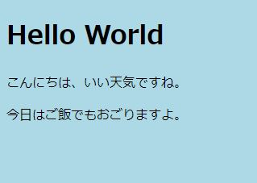
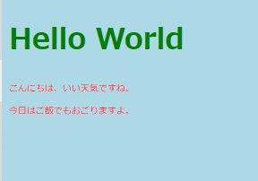
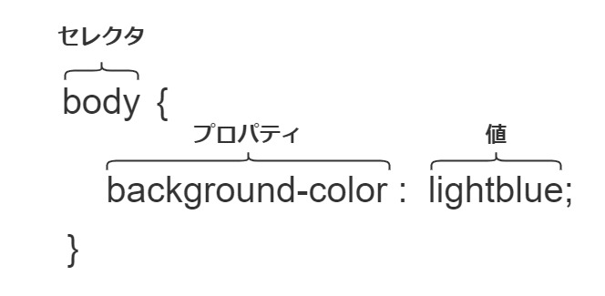

# CSSでスタイリングする

[#2](/HelloWeb/02/)の講座では、簡単なhtmlファイルの作成を行いました。今回はCSSを使ってhtmlファイルをスタイリングしたいと思います。

CSSは**Cascading Style Sheets**(カスケーディング・スタイル・シート)の略であり、Webページ（≒HTML）を装飾・スタイリングするための**スタイルシート言語**です。

Cascadingの意味を調べてみると「連続したもの」「数珠繋ぎになったもの」との説明があります。しかし、CSSにおいてCascadingがどういった意味を持つかは後から説明します。

## CSSファイルを作成する

ではさっそくハンズオンを始めたいと思います。

まずは前回作成した`index.html`と同じ階層に`style.css`を作成してください。

※htmlファイルと同様、`style`の部分は変更可能です。慣習的に`style`が用いられていることが多いです。拡張子である`.css`は変更不可です。

また、cssファイルもhtmlファイルと同じように文字コードを`UTF-8`に設定してください。

そして再度`index.html`を開き、`head要素`内に以下のように**link要素**を追加します。

```html
<!DOCTYPE html>
<html lang="ja">
<head>
  <meta charset="UTF-8">
  <meta name="viewport" content="width=device-width, initial-scale=1.0">
  <link href="./style.css" rel="stylesheet">
  <title>Document</title>
</head>
<body>
  <h1>Hello World</h1>
  <p>こんにちは、いい天気ですね。</p>
  <p>今日はご飯でもおごりますよ。</p>
</body>
</html>
```

先ほど`style.css`を作成しましたが、そのファイルをhtmlファイルのhead要素で読み込みます。

`link要素`は**外部リソース**（今回のようなcssなどのファイル）を指定して取り込むための要素です。`href=〇〇`という形で、読み込ませたいファイルのパスを記述します。今回はhtmlファイルと同じ場所にcssファイルを置いているので`./style.css`とします。（パスの指定方法は別途詳しく説明します）。

その後ろに`rel="stylesheet"`と記述していますが、これは**読み込ませたいファイルの役割**を指定するものです（`rel`はrelationshipの略）。cssファイルを読み込ませているので`stylesheet`と記述します。この一文はcssファイルを読み込ませる時の定型文みたいなものです。意味を理解して憶えておきましょう。

以上を追記したら`index.html`ファイルを上書き保存します。

### 背景色を変更する

そしていよいよcssファイルの編集に取り掛かります。まずは背景色を青色に変更してみましょう。

`style.css`に以下のように記述してください。

```css
@charset "UTF-8";

body {
  background-color: lightblue;
}
```

htmlページを開くと以下のように、画面全体が薄い青色に変化しているはずです。



これでcssファイルを作成し、htmlファイルに読み込ませ、Webページをスタイリングすることに成功しました🎉🎉🎉

もし、上手くいかない（ページの背景色が変わらない）場合には、もう一度ここまでの手順を見直し、正確に記述できているかを確認してください。

※上手くいかなければ、一度、このページに記載されている内容を丸ごとコピーすることをお勧めします。

失敗の原因には様々なことが考えられてますが、その一つ一つの内容を詳しく記述するには余白が足りません。簡単なチェックリストを用意しましたので上から順番に見ていってください。

 - ✅ 目的の`index.html`をブラウザに表示しているか？（間違って違うhtmlファイルを表示させていないか？）
 - ✅ `index.html`と同じフォルダに`style.css`を作成したか？
 - ✅ `index.html`の`head属性`に`link属性`を追記したか？
 - ✅ `index.html`の`link属性`の`href="./style.css"`は正しいか？
 - ✅ `style.css`の内容は正しいか？

白状すると、私も「CSSが適用されないムキー:angry:」となることが半年に一回くらいあります。しかし、**PCやブラウザのバグ**という可能性はほとんどないので、こちら側で何かケアレスミスしているはずです。注意深く確認しましょう。

### 文字を色々変更してみる

細かいことは後回しにして、文字の色や大きさについても変更してみます。

`style.css`に以下を追記してください。

```css
(略)

h1 {
  color: green;
}

p {
  color: red;
  font-size: 10px;
}
```

何をしてるかは何となく分かりますよね。ページをリロードすると以下のように変化しているはずです。



## CSSの書き方

では、`style.css`の中身を見ながら、CSSの書き方を説明します。

まず1行目には文字コードを指定します。「このファイルの文字コードはUTF-8で書かれています」ということを宣言するための一文です。

```css
@charset "UTF-8";
```

`style.css`はUTF-8で保存しましたので、同様にUTF-8を指定します。この一文は必ず**cssファイルの先頭**に記述する必要があります。

### セレクタ

CSSは、「どの要素のどの見た目をどんな風に表示する」という風に指定して記述していきます。この中で「どの要素」を表すのが**セレクタ**と呼ばれている部分です。具体的には、`body`、`h1`、`p`が当てはまります。

どの要素をセレクトするか、だからセレクタです。憶えやすいですね。

セレクタを記述したら、波括弧`{}`を記述します。`{`と`}`の間に、これから紹介するプロパティと値を記述します。

```css
body {
  /* body要素のスタイルを指定 */
}

h1 {
  /* h1要素のスタイルを指定 */
}

p {
  /* p要素のスタイルを指定 */
}
```

### プロパティ

次に、指定した要素の「どの見た目」に該当する**プロパティ**を記述します。

今回の例で言うと、body要素では`background-color`プロパティを記述しています。これは**背景色**を指定するプロパティです。

続けて、h1要素では`color`プロパティを記述しています。これは**文字の色**を指定するプロパティです。

p要素では`font-size`プロパティを記述しています。これは**文字の大きさ**を指定するプロパティです。

そして、プロパティの後ろにはコロン`:`を記述します。この後ろには、この後紹介する値を記述します。

```css
body {
  /* 背景色を指定 */
  background-color:
}

h1 {
  /* 文字の色を指定 */
  color:
}

p {
  /* 文字の色を指定 */
  color:

  /* 文字の大きさを指定 */
  font-size: 
}
```

プロパティには非常に多くの種類があり、全てを憶えるのはほぼ不可能です。と言っても、上記例から分かる通り、プロパティの名前はとても説明的で直感的に分かりやすいため、代表的なものを憶えるのに苦労することはないはずです。

### 値

最後に、具体的にどのようにスタイリングするかの**値**を記述します。値にどのような「値」を入れられるかはプロパティごとに違います。これも地道に憶えていくしかありません。

`background-color`と`color`には色を指定する値が入ります。色の指定には様々な方法がありますが、ここはとりあえず直感的に分かりやすい`lightblue`や`green`、`red`などとしています。

`font-size`には文字の大きさを指定する数字が値として入ります。大きさにも様々な指定方法がありますが、ここではpx（ピクセル）を指定します。

そして値の後ろにはセミコロン`;`を記述し、値を記述したことを明示します。

```css
/* body要素の背景色を明るい青色にする */
body {
  background-color: lightblue;
}

/* h1要素の文字を緑色にする */
h1 {
  color: green;
}

/* p要素の文字を赤色にし、文字の大きさを10ピクセルにする */
p {
  color: red;
  font-size: 10px;
}
```

以上がCSSの`セレクタ`、`プロパティ`、`値`の説明です。この三つの単語はこれからもバシバシ出てくるので、思い出せるようにしておいてください。



## 基本は以上

さて、[前回](/HelloWeb/01/)と今回で、htmlとcssの必要最低限の文法を紹介しました。

これからHTMLとCSSについての細かい部分を学習していきますが、これまでに紹介した「htmlファイルに要素を記述、cssファイルで要素を指定してスタイリングする」という根本的な部分は変わりません。

次からはしばらくCSSはお休みして、HTMLを再度学習していきたいと思います。

## 参考

https://developer.mozilla.org/ja/docs/Learn/Getting_started_with_the_web/CSS_basics
http://www.htmq.com/csskihon/001.shtml
https://developer.mozilla.org/ja/docs/Web/CSS/@charset
https://developer.mozilla.org/ja/docs/Web/HTML/Link_types
https://developer.mozilla.org/ja/docs/Web/HTML/Element/link


