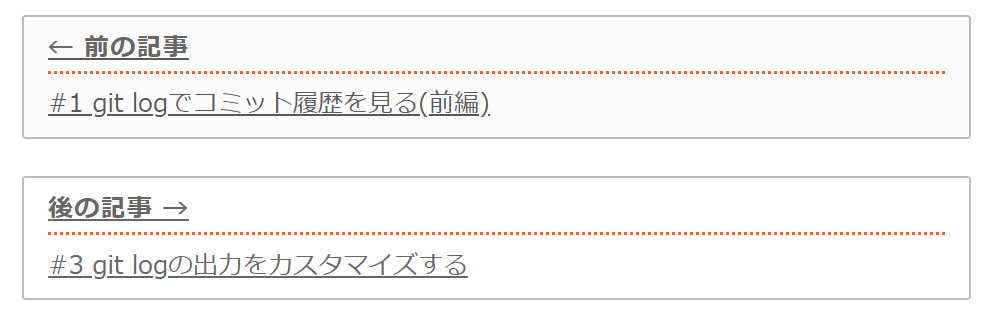

# Gaysbyでブログを始めました

情報をアウトプットできる場所が欲しいなと前から思っており、Qiitaやはてぶの利用も考えていましたが、「もっと気楽にやりたい」「自分メモ的なものも置きたい」「スタイルは自分で自由に変えたい」などと言い訳ばかりして全然進んでいませんでした。

しかし情報を仕入れているうちに、Gatsbyという静的サイトジェネレータを知り、「これは面白そうだ（楽できそうだ（面倒くさくなさそうだ））」と思い一念発起、重い腰をあげることにしました。

作りたいのはブログ≒単純な静的ページを集めたサイトだったので、バックエンドは不要。よってWordPress等のCMSは最初の内に選択肢から消えました。

興味のあったNginxでサーバを立てて動かしてみようとも思ったのですが、「静的サイトジェネレータを使ってみたい」「せっかくならJavaScriptでかけるものがいい」「新しい技術の習得も兼ねたい」ということで、いくつか選択肢はあったのですが、結局Gatsbyを採用しました。
(Next.jsやNuxt.jsは他の静的コンテンツで使用するつもりです。）

このページでは、当ブログの機能やこだわりポイントを書きなぐっています。

素人仕事で恐縮ですが、「Gatsbyってどんなことができるの❓」「使ってみたいけど何か難しそう…:confused:」など、Gatsbyでのブログ作成を考えている方の参考になれば幸いです。

くそ雑魚エンジニアの僕でもこれくらいはできたので、敷居は高くないと思います。

## Point1 マークダウンでの記事作成

記事は全てマークダウンファイルで用意しています。

当初はヘッドレスCMSであるContentfulの導入を考えていましたが、高機能で便利な代わりに自由度はマークダウンの方が高そうだったのでこちらに変更しました。

何より、ローカルで好きな時にさくっと作業できるというのがいいですね。

### プラグインを使用してより充実した記事に

マークダウン用にたくさんのGatsbyプラグインが用意されています。

技術ブログでは必須のコードブロックとシンタックスハイライトですが、`gatsby-remark-prismjs`というプラグインを使用し、簡単に実現できます。

行番号の表示や特定行のハイライトも当然可能です。

```typescript{2}:title=script.ts

function func(id: number): void {
  console.log(id)
}

func(1)

```

また、`gatsby-remark-emoji`プラグインを使用すれば絵文字を使用できます。:stuck_out_tongue_closed_eyes:

## Point2 コンテンツの取得はGraphQLで

こだわりポイントというかGatsbyがそういう作りになっているのですが、Gatsbyでは**GraphQL**というクエリ言語を使用してコンテンツを取得、サイトを構築（ビルド）します。

例えばこのページのヘッダに、当サイトのサイト名である「鳥に生まれることができなかった人へ」という文字を表示させていますが、これはmarkdownやReactコンポーネントに「鳥に生まれる～」とべた書きしているのではなく、`gatsby-config.js`というファイルに以下のような形でサイト名を記述、ビルド時にGraphQLがこれを取得、表示させてくれています。

```javascript{3}:title=gatsby-config.js
module.exports = {
  siteMetadata: {
    title: `鳥に生まれることができなかった人へ`,
    siteUrl: `https://blog.toriwatari.work/`,
    author: {
      name: `Kento Yoshizu`,
      summary: `Hello World`,
    },
    description: `IT技術ブログとその他趣味`,

    (略)
```

以下が`gatsby-config.js`で定義したサイト名を取得するgraphqlクエリです。

```graphql:title=header.js
query {
  site {
    siteMetadata {
      title
    }
  }
(略)
```

これをおおむね以下のような感じでheaderコンポーネントに渡しています。

```javascript:title=header.js

```

Gatsbyを選んだそもそもの理由が「クエリ言語にGraphQLを採用しているから」というのもありましたし、結果的にいい勉強になったと思っています。

## Point3 カテゴリ機能とタグ機能

それぞれの記事にカテゴリとタグを付与し、必要に応じて収集し利用しています。

たとえば、[こちら](https://blog.toriwatari.work/categories/)にアクセスすると、当ブログのカテゴリ一覧と各カテゴリの記事件数が表示されます。

これももちろん、僕が一つ一つ手で書いてるのではなく、GraphQLを使用しコンテンツを取得、Gatsbyが自動でページを生成してます。

マークダウンファイルの先頭に以下のようにyaml風味な形式（frontmatterと呼ばれています）で、記事が属するカテゴリやタグを記述します。

```markdown:title=例：このページのfrontmatter
---
title: "Gatsbyでブログを始めました"
postdate: "2021-02-05"
updatedate: "2021-02-05"
categoryName: "日記"
categorySlug: diary
description: "静的サイトジェネレータのGatsbyを使用してブログを立ち上げました。"
tags: ["日記", "Gatsby"]
---
```

`gatsby-node.js`を使用し、ビルド時に「GraphQLでマークダウンファイルの情報（frontmatter）を取得、それらを同じカテゴリの記事ごとに集約、それらをリスト化したページを作成」、というようなことをやってくれています。

また、[こちら](https://blog.toriwatari.work/category/GitAdvance/page/1/)のページでは「Git中級者を目指す」というカテゴリの記事一覧をリストアップしています。

これもGraphQLを使用し、「同じカテゴリの記事一覧を取得、記事数だけループで表示させる」ということをやっています。

## Point4 「前後の記事へ」機能

このページの下までいくと「次の記事」というリンクがあります。

これはGraphQLで「同じカテゴリの記事を投稿日付順に取得、このページの記事の前後のリンクを作成する」ということをやっています。

わかってしまえば簡単ですが、ここで結構はまった記憶が…。

## Point5 ページネーション機能

多分、実装に一番時間をかけた機能です。

1ページに何十件も記事がリストアップされると困りますよね。当ブログでは1ページ当たり6件の記事を表示される、としてページネーション機能を付与しました。


GraphQLで「全ての記事の個数をカウント、6で割ってその数だけページを生成」します。後はページの数だけリンクを表示させてあげたり、前後のページへ移動するprev、nextボタンを設置しました。

なお、このページネーションの機能はカテゴリ、タグごとの記事一覧にも同じように設置しています。

地味に大変だったのが、ページネーションのリンクの一部を省略する機能を実装することでした。

## Point6 デプロイはAWS Amplifyで



# これから

現時点でGatsbyには不満がないのでこれからも使っていくと思います。
今はNetlifyでホスティングしているのでAWSに移行するのが目標です。


