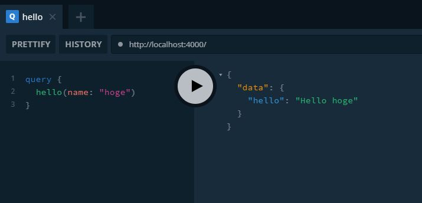
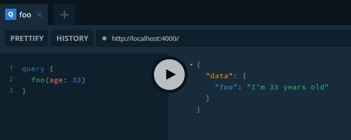

```shell
$ yarn init
yarn init v1.22.5
question name (graphql_1):
question version (1.0.0):
question description:
question entry point (index.js): index.ts
question repository url:
question author (potsunen <potsunen@potsunen.com>):
question license (MIT):
question private:
success Saved package.json
Done in 15.36s.
```

```javascript{1, 3}
const { GraphQLServer } = require('graphql-yoga');

const typeDefs = `
  type Query {
    hello(name: String): String!,
  }
`
const resolvers = {
  Query: {
    hello: (_, { name }, context) =>
      `Hello ${name || 'World'}`,
  },
}

const server = new GraphQLServer({ typeDefs, resolvers })
server.start(() => console.log('Server is running on localhost:4000'))
```



```javascript
const { GraphQLServer } = require('graphql-yoga');

const typeDefs = `
  type Query {
    foo(age: Int): String!,
  }
`

const resolvers = {
  Query: {
    foo: (_, { age }) => 
      `I'm ${ age } years old`
  },

}

const server = new GraphQLServer({ typeDefs, resolvers })
server.start(() => console.log('Server is running on localhost:4000'))
```


